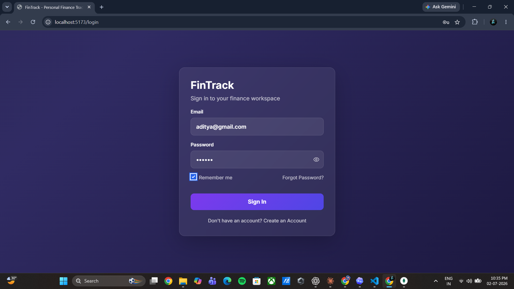
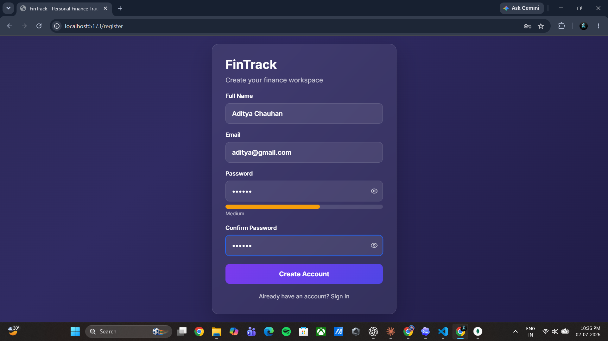
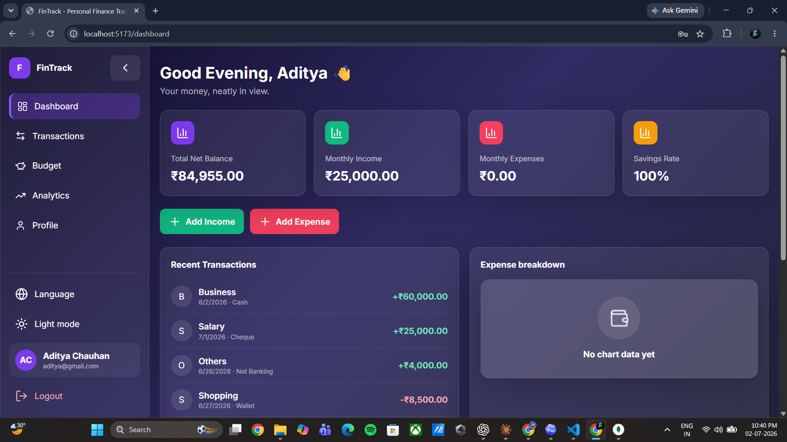
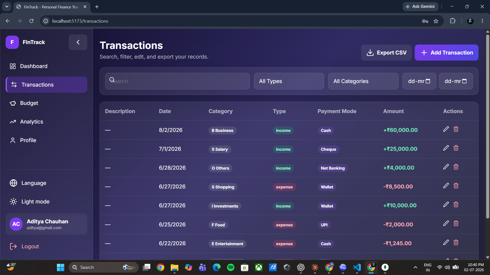
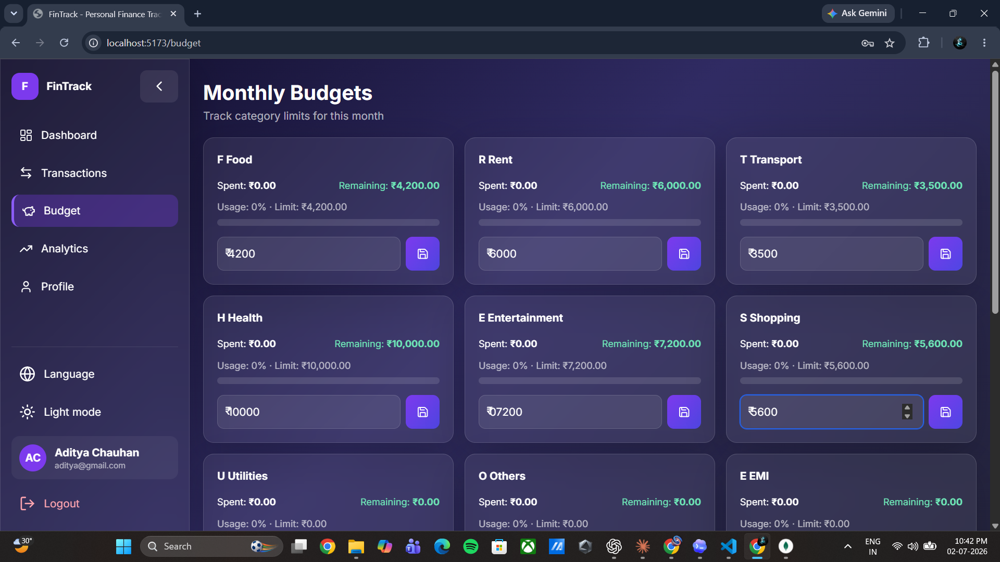
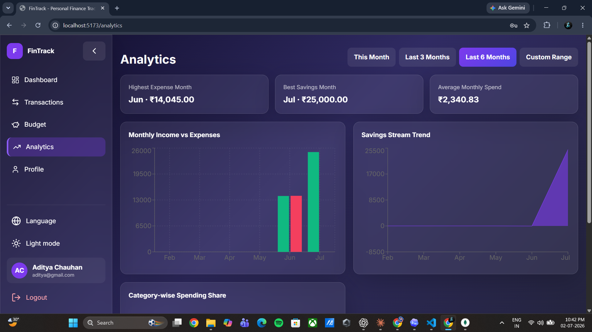
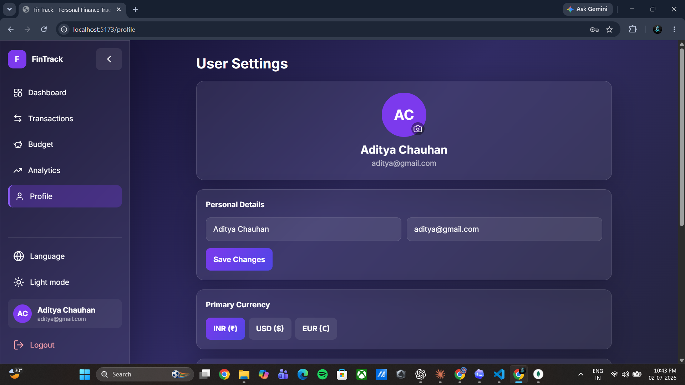

<div align="center">


# 💰 FinTrack — Personal Finance Tracker

### A premium full-stack MERN application to track your income, expenses, budgets & analytics

[](https://reactjs.org/)
[](https://nodejs.org/)
[](https://mongodb.com/)
[](https://tailwindcss.com/)
[](https://vitejs.dev/)
[](LICENSE)

[🚀 Live Demo](#) · [📸 Screenshots](#-screenshots) · [⚙️ Installation](#%EF%B8%8F-installation) · [🛠️ Tech Stack](#%EF%B8%8F-tech-stack)

</div>

---

## 📋 Table of Contents

- [About](#-about)
- [Screenshots](#-screenshots)
- [Features](#-features)
- [Tech Stack](#%EF%B8%8F-tech-stack)
- [Project Structure](#-project-structure)
- [Installation](#%EF%B8%8F-installation)
- [Environment Variables](#-environment-variables)
- [API Endpoints](#-api-endpoints)
- [Deployment](#-deployment)
- [Author](#-author)

---

## 🌟 About

**FinTrack** is a production-ready, full-stack personal finance management web application built with the MERN stack. It allows users to track income and expenses, set monthly budgets per category, view detailed analytics with charts, and manage their financial data securely — all in a stunning glassmorphism dark UI with smooth Framer Motion animations.

Designed specifically for the **Indian population** with ₹ INR as default currency, Indian number formatting (1,00,000), UPI payment mode support, Indian expense categories, and support for **10 Indic languages**.

---

## 📸 Screenshots

> **How to add screenshots:** Take screenshots of your app → save them in a folder called `screenshots/` in your project root → upload to GitHub → replace the paths below with your actual image paths.

### 🔐 Login & Register
<!-- Add your screenshots below — replace paths with actual image filenames -->
| Login Page | Register Page |
|---|---|
|  |  |

### 🏠 Dashboard


### 💸 Transactions


### 📊 Budget


### 📈 Analytics


### 👤 Profile / Settings


---

## ✨ Features

### 🔐 Authentication
- Secure JWT-based login & registration
- bcryptjs password hashing (saltRounds: 12)
- Protected routes — redirects to login if unauthenticated
- Persistent session via localStorage token
- Auto logout on token expiry

### 🏠 Dashboard
- Animated stat cards: Total Balance, Monthly Income, Monthly Expenses, Savings Rate
- Recent 5 transactions with category icons
- Income vs Expense line chart (last 6 months)
- Category-wise expense donut chart
- Budget alert banners (when >80% of limit spent)
- Indian festival nudge banners (Diwali, Holi, Ganesh Chaturthi)

### 💸 Transactions
- Add, Edit, Delete income/expense transactions
- Filter by date range, category, type
- Live search by description or category
- Pagination (10 per page)
- Payment Mode field: UPI, Cash, Card, Net Banking, etc.
- Export all transactions as CSV

### 📊 Budget
- Set monthly budget limits per category
- Animated progress bars (green → amber → red)
- Over Budget badge when limit exceeded
- Tracks spending against current month automatically

### 📈 Analytics
- Date range selector: This Month / Last 3 / Last 6 Months / Custom
- Monthly Income vs Expense bar chart
- Savings trend area chart
- Category-wise pie chart
- Key insights: Highest expense month, Best savings month, Average spend

### 👤 Profile
- Edit full name and email
- Change password securely
- Currency selector: ₹ INR / $ USD / € EUR (updates globally instantly)
- Delete account with full data wipe

### 🌐 Multi-language Support (10 Indic Languages)
| Language | Code |
|---|---|
| English | en |
| हिंदी (Hindi) | hi |
| বাংলা (Bengali) | bn |
| తెలుగు (Telugu) | te |
| मराठी (Marathi) | mr |
| தமிழ் (Tamil) | ta |
| ગુજરાતી (Gujarati) | gu |
| ಕನ್ನಡ (Kannada) | kn |
| മലയാളം (Malayalam) | ml |
| ਪੰਜਾਬੀ (Punjabi) | pa |

### 🇮🇳 India-Specific Features
- Default currency: ₹ INR with Indian number format (1,00,000)
- Indian expense categories: EMI, SIP, Petrol/CNG, Zomato/Swiggy, DTH, etc.
- UPI payment mode support
- Festival budget nudge banners

---

## 🛠️ Tech Stack

### Frontend
| Technology | Purpose |
|---|---|
| React.js 18 (Vite) | UI Framework |
| React Router v6 | Client-side routing |
| Tailwind CSS | Styling |
| Framer Motion | Animations |
| Recharts | Charts & graphs |
| Lucide React | Icons |
| React Hot Toast | Notifications |
| Axios | HTTP client |
| i18next + react-i18next | Multi-language support |
| Context API | Global state management |

### Backend
| Technology | Purpose |
|---|---|
| Node.js | Runtime |
| Express.js | REST API framework |
| MongoDB + Mongoose | Database & ODM |
| bcryptjs | Password hashing |
| JSON Web Token (JWT) | Authentication |
| cors | Cross-origin requests |
| dotenv | Environment variables |
| express-validator | Input validation |

### Tools & Deployment
| Tool | Purpose |
|---|---|
| Vite | Frontend build tool |
| nodemon | Backend dev server |
| concurrently | Run both servers together |
| Vercel | Frontend deployment |
| Render | Backend deployment |
| MongoDB Atlas | Cloud database |

---

## 📁 Project Structure

```
fintrack/
├── client/                        # React frontend (Vite)
│   ├── src/
│   │   ├── api/
│   │   │   └── axios.js           # Axios instance with JWT interceptor
│   │   ├── components/            # Sidebar, Navbar, Modal, Charts
│   │   ├── context/
│   │   │   ├── AuthContext.jsx    # Auth state & JWT management
│   │   │   └── CurrencyContext.jsx # Global currency formatting
│   │   ├── i18n/
│   │   │   ├── i18n.js            # i18next config
│   │   │   └── translations/      # 10 language JSON files
│   │   ├── pages/
│   │   │   ├── Login.jsx
│   │   │   ├── Register.jsx
│   │   │   ├── Dashboard.jsx
│   │   │   ├── Transactions.jsx
│   │   │   ├── Budget.jsx
│   │   │   ├── Analytics.jsx
│   │   │   └── Profile.jsx
│   │   ├── App.jsx
│   │   └── main.jsx
│   ├── vercel.json                # Vercel SPA rewrite rule
│   └── package.json
│
├── server/                        # Node.js + Express backend
│   ├── config/db.js               # MongoDB connection
│   ├── models/
│   │   ├── User.js
│   │   ├── Transaction.js
│   │   └── Budget.js
│   ├── routes/
│   │   ├── auth.js
│   │   ├── transactions.js
│   │   └── budgets.js
│   ├── controllers/
│   ├── middleware/
│   │   ├── authMiddleware.js      # JWT verification
│   │   └── errorHandler.js
│   ├── server.js
│   └── package.json
│
├── .gitignore
├── package.json                   # Root scripts
└── README.md
```

---

## ⚙️ Installation

### Prerequisites
- Node.js v18+
- MongoDB (local) or MongoDB Atlas account
- Git

### 1. Clone the Repository

```bash
git clone https://github.com/aditya-chauhan007/Personal-Finance-Tracker--FinTrack.git
cd Personal-Finance-Tracker--FinTrack
```

### 2. Install All Dependencies

```bash
# Install root + client + server dependencies
npm run install:all
```

Or manually:

```bash
# Root
npm install

# Client
cd client && npm install

# Server
cd ../server && npm install
```

### 3. Setup Environment Variables

Create `server/.env`:

```env
PORT=5000
MONGO_URI=mongodb://localhost:27017/fintrack
JWT_SECRET=your_super_secret_jwt_key_here
CLIENT_URL=http://localhost:5173
```

Create `client/.env.development`:

```env
VITE_API_URL=http://localhost:5000
```

### 4. Start the Application

```bash
# Run both frontend and backend together
npm run dev
```

Or separately:

```bash
# Terminal 1 — Backend
npm run dev:server

# Terminal 2 — Frontend
npm run dev:client
```

### 5. Open in Browser

```
Frontend: http://localhost:5173
Backend:  http://localhost:5000
```

---

## 🔐 Environment Variables

### Server (`server/.env`)

| Variable | Description | Example |
|---|---|---|
| `PORT` | Backend server port | `5000` |
| `MONGO_URI` | MongoDB connection string | `mongodb://localhost:27017/fintrack` |
| `JWT_SECRET` | Secret key for JWT signing | `your_secret_key` |
| `CLIENT_URL` | Frontend URL for CORS | `http://localhost:5173` |

### Client (`client/.env.development`)

| Variable | Description | Example |
|---|---|---|
| `VITE_API_URL` | Backend API base URL | `http://localhost:5000` |

---

## 📡 API Endpoints

### Auth Routes (`/api/auth`)
| Method | Endpoint | Description | Auth |
|---|---|---|---|
| POST | `/api/auth/register` | Register new user | ❌ |
| POST | `/api/auth/login` | Login user | ❌ |
| GET | `/api/auth/me` | Get current user | ✅ |
| PUT | `/api/auth/profile` | Update profile/password/currency | ✅ |
| DELETE | `/api/auth/account` | Delete account + all data | ✅ |

### Transaction Routes (`/api/transactions`)
| Method | Endpoint | Description | Auth |
|---|---|---|---|
| GET | `/api/transactions` | Get all transactions | ✅ |
| POST | `/api/transactions` | Create transaction | ✅ |
| PUT | `/api/transactions/:id` | Update transaction | ✅ |
| DELETE | `/api/transactions/:id` | Delete transaction | ✅ |

### Budget Routes (`/api/budgets`)
| Method | Endpoint | Description | Auth |
|---|---|---|---|
| GET | `/api/budgets` | Get budgets (current month) | ✅ |
| PUT | `/api/budgets/:category` | Set/update budget limit | ✅ |

---

## 🚀 Deployment

### Frontend — Vercel
1. Go to [vercel.com](https://vercel.com)
2. Import GitHub repository
3. Set **Root Directory** to `client`
4. Add environment variable: `VITE_API_URL=https://your-backend.onrender.com`
5. Deploy ✅

### Backend — Render
1. Go to [render.com](https://render.com)
2. New Web Service → Connect GitHub repo
3. Set **Root Directory** to `server`
4. Build command: `npm install`
5. Start command: `node server.js`
6. Add environment variables (PORT, MONGO_URI from Atlas, JWT_SECRET, CLIENT_URL)
7. Deploy ✅

### Database — MongoDB Atlas
1. Go to [mongodb.com/atlas](https://mongodb.com/atlas)
2. Create free cluster
3. Get connection string
4. Replace `MONGO_URI` in Render environment variables

---

## 👨‍💻 Author

**Aditya Chauhan**

[](https://github.com/aditya-chauhan007)

---

## 📄 License

This project is licensed under the MIT License — see the [LICENSE](LICENSE) file for details.

---

<div align="center">

Made with ❤️ by **Aditya Chauhan**

⭐ Star this repo if you found it helpful!

</div>
